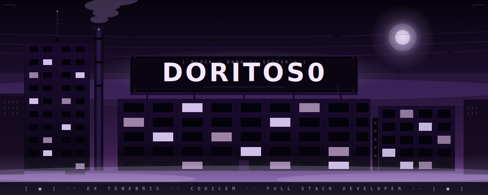
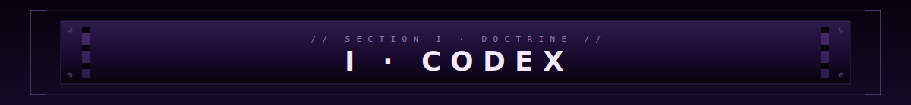
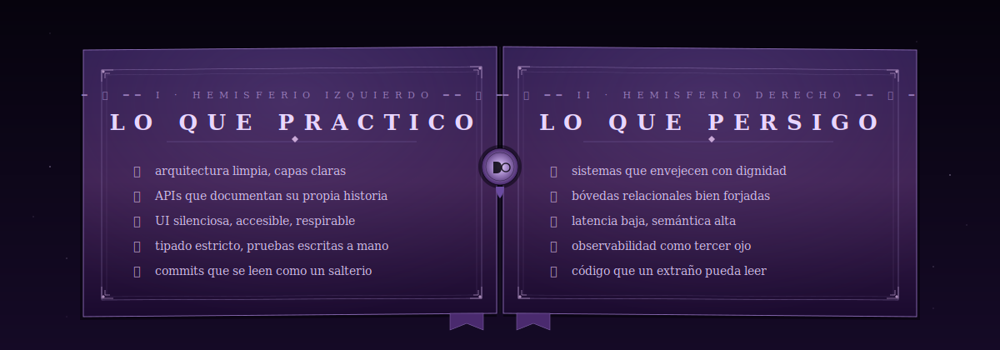
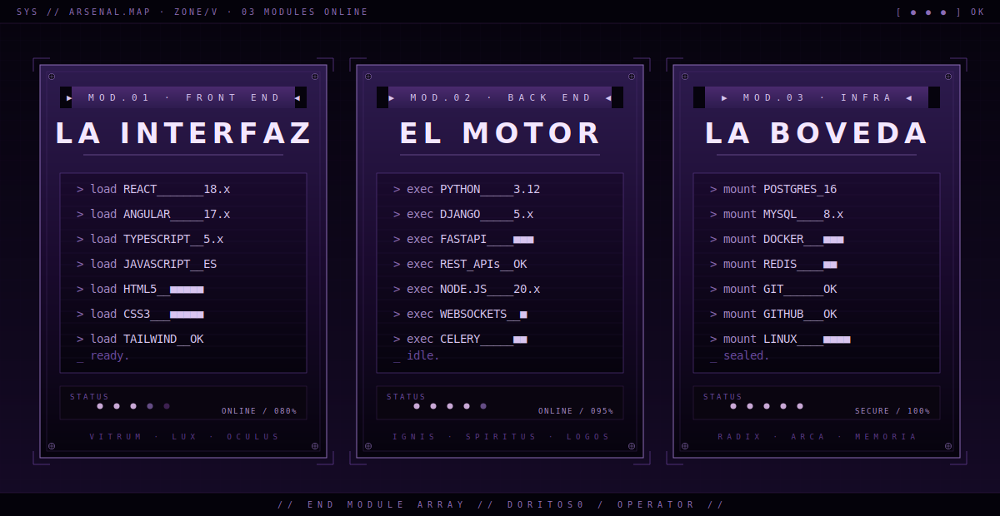
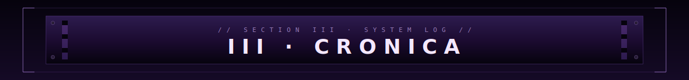
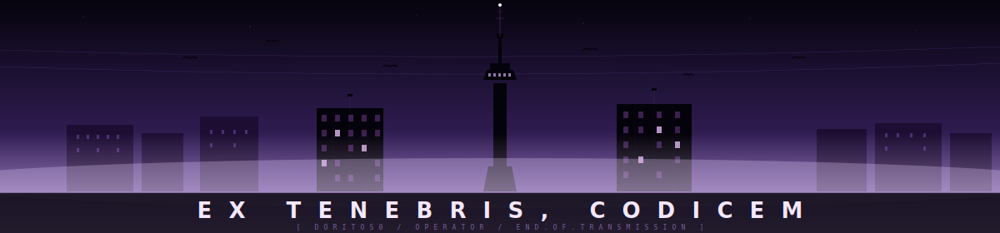

  

  

  

  

  

  

  

  

  

&nbsp;

  

  

  

  

  

  

  

  <picture>
    <source srcset="https://gh-heat.anishroy.com/api/Doritos0/svg?theme=purple&darkMode=true" media="(prefers-color-scheme: dark)" />
    <source srcset="https://gh-heat.anishroy.com/api/Doritos0/svg?theme=purple&darkMode=false" media="(prefers-color-scheme: light)" />
    
  </picture>

  

  

