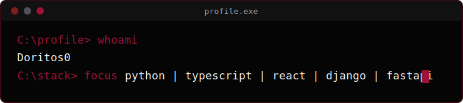

  

  
  

  

  

  <table align="center">
    <tr>
      <td rowspan="2" valign="top">
        
      </td>
      <td valign="top">
        
      </td>
    </tr>
    <tr>
      <td valign="top">
        
      </td>
    </tr>
  </table>

  

  

  

