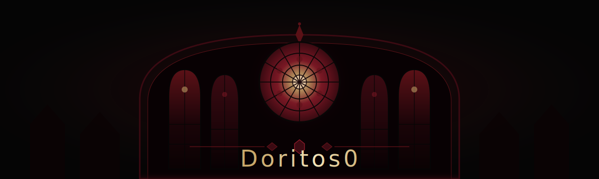
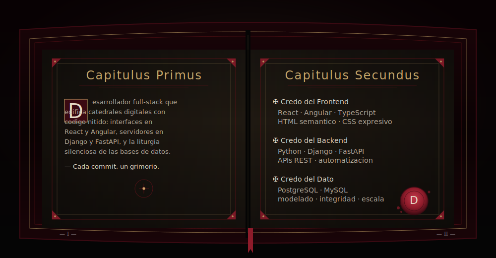
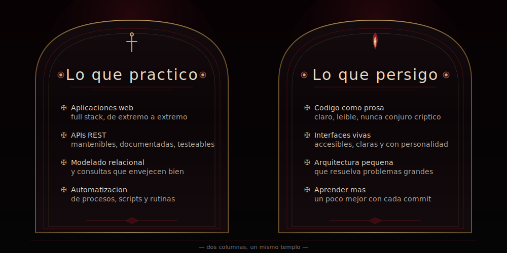
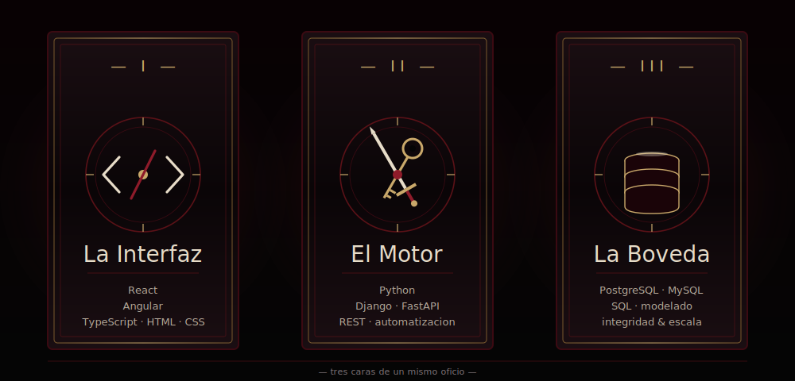
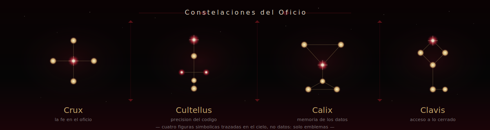
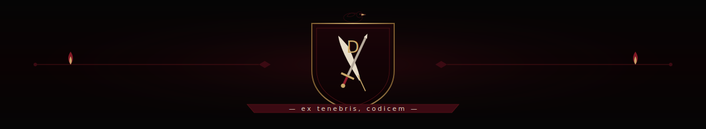

  

  

  
  
  
  

 

> <samp>«Cada función es un rezo, cada commit una reliquia, cada deploy un acto litúrgico.»</samp>

 

---

## <samp>𓆩 ☩ 𓆪 &nbsp; Pr&oacute;logo &nbsp; 𓆩 ☩ 𓆪</samp>

Soy <b>Doritos0</b>, desarrollador web full stack. Construyo interfaces que respiran y servicios que sostienen. Me importa la claridad estructural, la mantenibilidad y la elegancia silenciosa de un sistema que <i>simplemente funciona</i>. Lo que sigue es un breve grimorio: tres capítulos para contarme, tres arcanos para mostrarme y una crónica de huellas dejadas en GitHub.

 

  

 

## <samp>𓏲 &nbsp; I. El Grimorio Abierto &nbsp; 𓏲</samp>

  

 

  

 

  

 

## <samp>𓊛 &nbsp; II. Tres Arcanos del Oficio &nbsp; 𓊛</samp>

  

<b>La Interfaz</b> · <b>El Motor</b> · <b>La Bóveda</b> &nbsp;—&nbsp; tres caras de un mismo oficio.

 

  

 

<table>
<tr>
<td align="center" width="33%">
<samp>— Frontend —</samp> 

</td>
<td align="center" width="33%">
<samp>— Backend —</samp> 

</td>
<td align="center" width="33%">
<samp>— Bóveda —</samp> 

</td>
</tr>
</table>

 

  

 

## <samp>𖤐 &nbsp; III. Cr&oacute;nica Visible &nbsp; 𖤐</samp>

  
  &nbsp;
  

 

  

 

  

 

  

 

## <samp>☧ &nbsp; IV. Vestigios del Camino &nbsp; ☧</samp>

  

 

  

 

  

 

## <samp>† &nbsp; Ep&iacute;logo &nbsp; †</samp>

  

 

  

  <i>— construido a la luz de un solo cirio, refactorizado al alba —</i>

