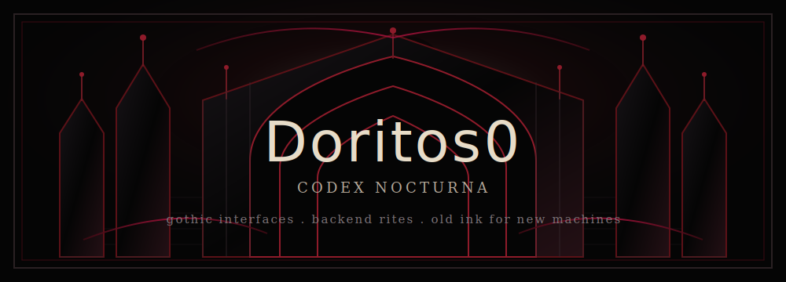
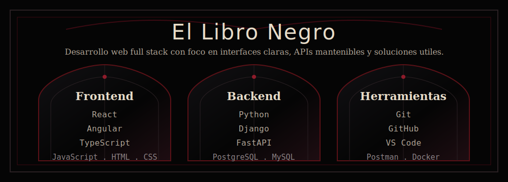

  

<h1 align="center">
  
</h1>

  
  
  

  

  <i>Desarrollador web enfocado en crear interfaces claras, APIs mantenibles y soluciones que conectan datos, procesos y experiencia de usuario.</i>

 

  

  

 

  

  

  

 

  

  <table align="center">
    <tr>
      <td rowspan="2" valign="top">
        
      </td>
      <td valign="top">
        
      </td>
    </tr>
    <tr>
      <td valign="top">
        
      </td>
    </tr>
  </table>

  

 

  

<picture>
  <source srcset="https://gh-heat.anishroy.com/api/Doritos0/svg?theme=red&darkMode=true" media="(prefers-color-scheme: dark)"/>
  <source srcset="https://gh-heat.anishroy.com/api/Doritos0/svg?theme=red&darkMode=false" media="(prefers-color-scheme: light)"/>
  
</picture>

  

  

